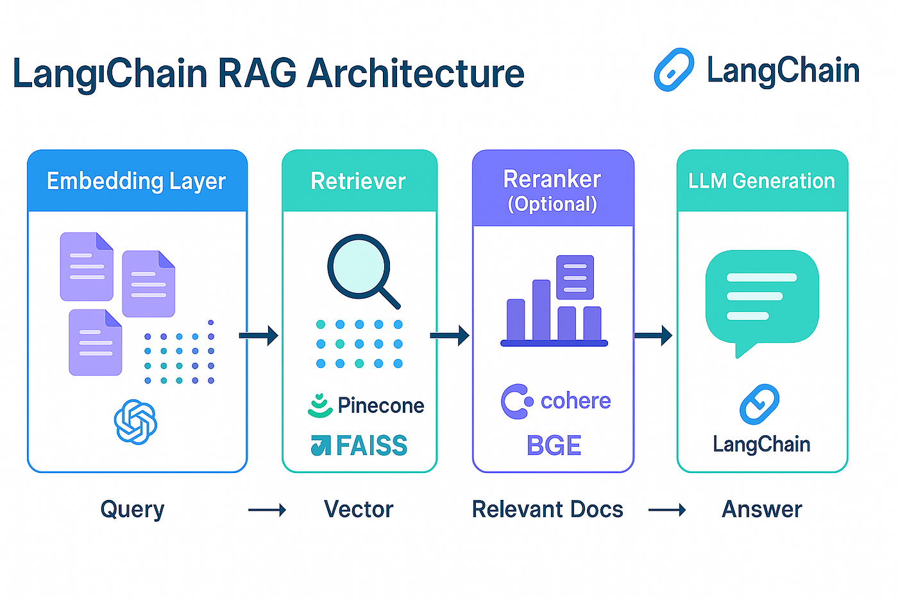
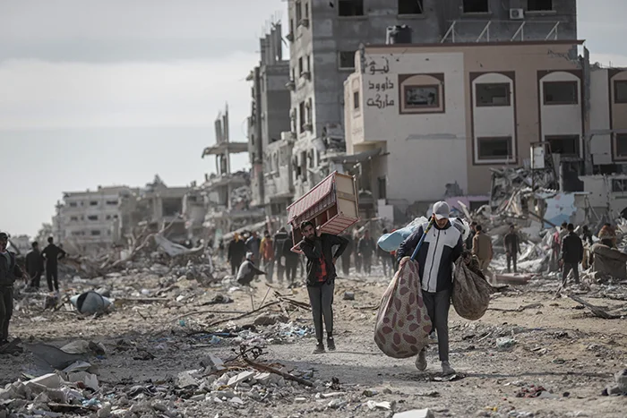

Here is a selection of my projects, ranging from data analytics dashboards to AI pipelines and web crawlers.

::: {layout-ncol=2}

::: {.card}

**[Rift Dashboard](https://github.com/zazos/Rift-Dashboard)**

A full-stack League of Legends analytics dashboard for meta trends, rank disparities, and summoner profiling.
:::

::: {.card}

**[Conversational RAG System with Automated Evaluation](https://github.com/zazos/ai-npc-langgraph)**

A RAG pipeline built with LangChain, LangGraph, and ChromaDB, with a dual-provider LLM backend (cloud/local). Includes a custom LLM-as-a-Judge evaluation harness measuring context precision, faithfulness, answer relevance, and correctness against a hand-crafted ground-truth dataset.
:::

::: {.card}

**[Multi-Agent System Design with Claude Code](https://github.com/zazos/claude-code-dungeon-master)**

A three-agent pipeline built using Claude Code primitives — slash commands, subagents, and skills. Strict role separation between a narration agent, a rules interpreter, and a forked-context NPC agent. All arithmetic offloaded to an external Python engine; progressive skill loading used to minimize context window cost per turn.
:::

::: {.card}

**[Deep MER Clustering](https://github.com/zazos/Deep-MER-Clustering)**

My Master's Thesis: A complete pipeline for Music Emotion Recognition (MER) combining unsupervised clustering, Large Language Models (LLMs), and parameter-efficient Deep Learning. This project bridges the semantic gap between human perception and raw acoustic features using LLM-assisted clustering and a dual-branch Deep Learning architecture.
:::

::: {.card}

**[Humanitarian Crisis Website](https://github.com/zazos/DataViz-website)**

A website dedicated to providing insightful data visualizations on the Palestinian conflicts and humanitarian crisis (Oct 2023 - Apr 2024). Features interactive maps, time-series charts, and analysis of commodity prices and water quality to foster informed dialogue.
:::

::: {.card}

**[TikTok Crawler](https://github.com/zazos/TikTok-Crawler)**

TikTok Crawler using BeautifulSoup and Selenium to gather data.
:::

:::
